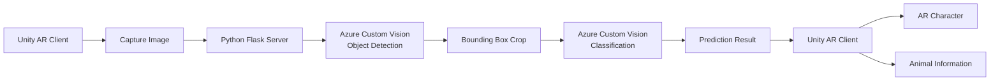
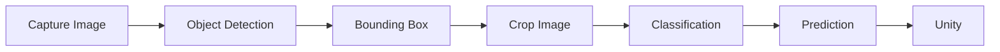
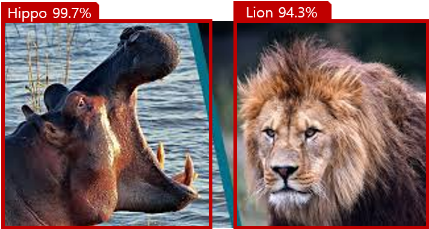
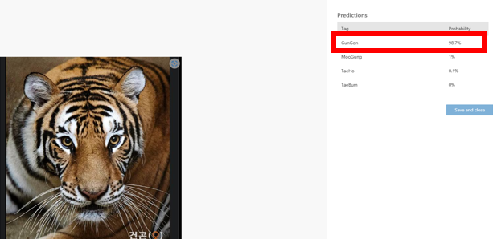
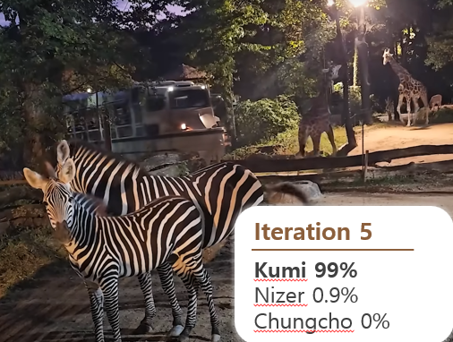
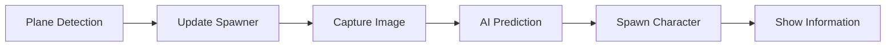
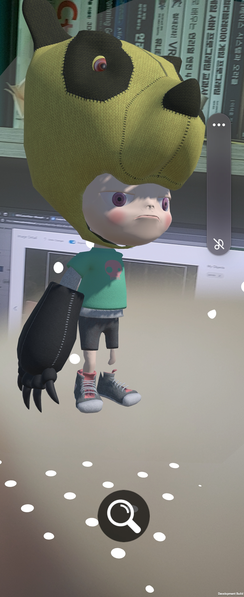
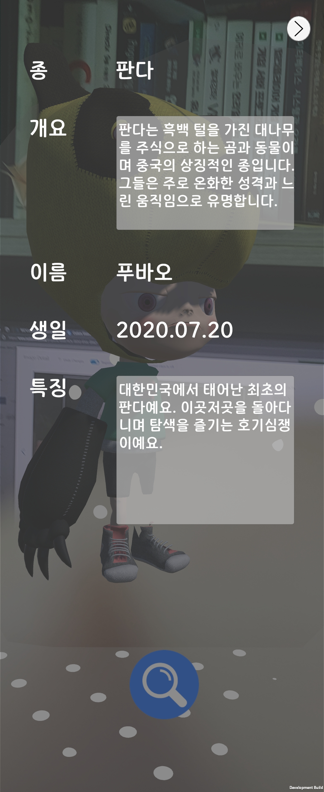

# AR Animal Recognition

> Azure Custom Vision 기반 2단계 AI 인식(Object Detection + Classification)을 적용한
> Unity 증강현실(AR) 동물 개체 인식 프로젝트

## 🎬 Demo
\-▶ Demo (https://youtube.com/shorts/sGxhFmIRSRA?feature=share)  

---

## 프로젝트 소개

Azure Custom Vision의 Object Detection과 Classification을 결합한
2단계 AI 인식 파이프라인을 적용하여
동물을 탐지하고 개체를 식별하는 모바일 AR 애플리케이션입니다.

기존 AR 애플리케이션이 객체를 인식하는 수준에 머무르는 것과 달리,
탐지된 객체를 다시 분류하여 동일한 종에 속한 개체를 식별하고,
Unity 환경에서 해당 위치에 AR 캐릭터와 개체 정보를 제공합니다.

최종적으로는 수집한 AR 캐릭터를 활용한 미니게임까지 확장하는 것을 목표로 설계했으며,
현재는 동물 탐지, 개체 인식, AR 캐릭터 생성 기능까지 구현했습니다.

---

## 프로젝트 개요

| 항목 | 내용 |
|------|------|
| 프로젝트명 | AR Animal Recognition |
| 프로젝트 형태 | Microsoft AI School 팀 프로젝트 |
| 개발 기간 | 2024.07.18 ~ 2024.07.25 (8일) |
| 개발 인원 | 4명 |
| 역할 | Team Leader / Unity Client / AR / Azure Custom Vision Integration |

### 담당 역할

- 프로젝트 일정 관리 및 개발 방향 조율
- Unity 기반 모바일 AR 애플리케이션 개발
- Unity와 Python(Flask) 서버 연동
- Azure Custom Vision(Object Detection / Classification) 연동
- Detection 결과 기반 이미지 Crop 및 2단계 AI 인식 파이프라인 구현
- 인식 결과에 따른 AR 캐릭터 및 정보 UI 구현
- 프로젝트 발표 및 시연

---

## 시스템 아키텍처


Unity에서 촬영한 이미지를 Python(Flask) 서버로 전송한 뒤,
Azure Custom Vision의 Object Detection을 통해 동물을 탐지합니다.

탐지된 영역(Bounding Box)만 추출(crop)하여 Classification 모델에 입력함으로써
동물의 개체를 식별하고,

최종 결과를 Unity로 전달하여
AR 캐릭터와 개체 정보를 표시하도록 구현했습니다.

---

## 기술 스택

| Category | Technologies |
|------|------|
| **Engine** | Unity 2022 |
| **Language** | C#, Python |
| **AI** | Azure Custom Vision (Object Detection / Classification) |
| **AR** | Unity AR Template |
| **Server** | Flask |
| **Version Control** | Git, GitHub |

---

## 주요 기능

### 1. 2단계 AI 인식 파이프라인
#### 배경

기존 Object Detection은 객체의 위치와 종류를 탐지하는 데에는 효과적이지만,
동일한 종에 속한 개체를 구분하는 데에는 한계가 있습니다.

예를 들어 판다를 탐지할 수는 있지만, 푸바오와 아이바오처럼 같은 종 내의 개체를 식별하기는 어렵습니다.

이를 해결하기 위해 Object Detection과 Classification을 결합한
2단계 AI 인식 파이프라인을 설계했습니다.

#### 설계

촬영한 이미지를 먼저 Object Detection 모델에 입력하여 동물의 위치를 탐지합니다.

이후 탐지된 영역(Bounding Box)만 추출하여 Classification 모델의 입력으로 사용함으로써,
배경의 영향을 최소화하고 동일한 종 내 개체를 식별할 수 있도록 구성했습니다.

#### 구현

Object Detection에서 반환한 영역(Bounding Box) 좌표를 이용하여
탐지된 영역만 추출한 뒤 Classification 모델에 전달하도록 구현했습니다.

```python
cropped_img = image.crop((left, top, right, bottom))
```

#### 처리 흐름



#### 실행 결과
##### 1단계. Object Detection

촬영한 이미지에서 동물의 위치를 탐지하고 추출할 영역(Bounding Box)을 생성합니다.

<p align="center">
  
</p>

##### 2단계. Classification

탐지된 영역만 Classification 모델에 전달하여
동일한 종 내의 개체를 식별합니다.

| 단일 개체 인식 | 다중 개체 인식 |
|:---:|:---:|
|  |  |

#### 결과

Object Detection과 Classification을 결합한 2단계 AI 인식 파이프라인을 적용하여
동물의 종류를 탐지한 뒤 동일한 종 내 개체를 식별할 수 있도록 구현했습니다.

또한 탐지된 영역만 Classification에 활용하여
배경의 영향을 최소화하고 개체 인식이 가능하도록 구성했습니다.

### 2. AI 기반 AR 콘텐츠 제공
#### 배경

AI가 인식한 결과를 단순히 텍스트로 제공하는 것에서 그치지 않고,
실제 공간에서 AR 캐릭터와 개체 정보를 함께 제공하여
사용자가 직관적으로 결과를 확인할 수 있도록 했습니다.

#### 설계

ARRaycastManager를 이용하여 사용자가 바라보는 평면을 지속적으로 탐지하고,
탐지된 위치를 Spawner의 위치로 갱신하도록 설계했습니다.

사진 촬영 후 AI 예측이 완료되면
Spawner 위치에 인식 결과에 대응하는 AR 캐릭터를 생성하고,
동시에 개체 정보를 화면에 표시하도록 구성했습니다.

#### 구현

ARRaycastManager를 통해 평면의 Hit Pose를 확인하여
Spawner 위치를 지속적으로 갱신했습니다.

사진 촬영 후 AI 예측 결과를 수신하면
기존 캐릭터를 제거한 뒤,
인식된 개체에 대응하는 AR 캐릭터를 생성하고
이름, 종, 생일, 특징 등의 정보를 함께 출력하도록 구현했습니다.

#### 처리 흐름


#### 실행 결과
| AR 캐릭터 생성 | 동물 정보 제공 |
|:---:|:---:|
|  |  |

AI 인식 결과에 따라
실제 공간에 AR 캐릭터를 생성하고,

동시에 이름, 종, 생일, 특징 등의 정보를 함께 제공하여
사용자가 동물 정보를 직관적으로 확인할 수 있도록 구현했습니다.

#### 결과

AI 인식 결과를 AR 콘텐츠와 연계하여
실제 공간에서 캐릭터와 개체 정보를 함께 제공하는
교육형 AR 콘텐츠를 구현했습니다.

---

## 기술적 문제 해결

### 1. 개체 인식을 위한 학습 데이터 부족
#### 문제

Object Detection은 동물의 종류를 탐지하는 데에는 충분했지만,
Classification은 푸바오와 아이바오처럼 동일한 종에 속한 개체를 구분해야 했습니다.

그러나 유명한 개체를 제외하면 개체별 학습 이미지를 충분히 확보하기 어려웠고,
학습 데이터 부족으로 인해 개체 인식 정확도를 높이는 데 한계가 있었습니다.

#### 해결

팀에서는 데이터 증강(Data Augmentation)을 통해
학습 이미지를 확장했습니다.

- Photoshop을 이용한 밝기 및 대비 조정
- 흑백 변환 및 외곽선 추출
- OpenCV를 이용한 노이즈 추가

등의 방법으로 다양한 학습 이미지를 생성하여
Classification 모델의 학습 데이터를 보강했습니다.

#### 나의 기여

저는 데이터 증강 과정에는 직접 참여하지 않았지만,

증강된 데이터를 활용하여
Classification 모델을 Unity 애플리케이션과 연동하고
전체 AI 인식 파이프라인을 구현했습니다.

#### 결과

제한적인 학습 이미지 환경에서도
동일한 종 내 개체를 보다 안정적으로 식별할 수 있었습니다.

### 2. 2단계 AI 인식 파이프라인 설계
#### 문제

초기에는 Object Detection만으로 동물을 인식하는 방식을 고려했습니다.

하지만 Object Detection은 객체의 위치와 종류를 탐지하는 데에는 적합했지만,
푸바오와 아이바오처럼 동일한 종에 속한 개체를 구분하기에는 한계가 있었습니다.

또한 탐지된 이미지를 그대로 Classification에 입력하면
배경이 함께 포함되어 개체 인식 정확도가 낮아질 가능성이 있었습니다.

#### 해결

Object Detection과 Classification을 결합한
2단계 AI 인식 파이프라인을 설계했습니다.

Object Detection으로 탐지한 영역(Bounding Box)만 추출하여
Classification 모델의 입력으로 사용함으로써

- 배경의 영향을 최소화하고  
- 동일한 종 내 개체를 보다 효과적으로 식별할 수 있도록 구성했습니다.  

#### 결과

Object Detection과 Classification의 역할을 분리하여
동물 탐지와 개체 인식을 각각 수행하도록 구현했습니다.

추출 영역(Bounding Box)만 활용하여 Classification을 수행함으로써
배경의 영향을 줄이고
개체 인식 정확도를 향상시킬 수 있었습니다.

---

## 회고

### 프로젝트를 통해 배운 점

이번 프로젝트를 통해 AI 모델의 성능뿐만 아니라
학습 데이터와 AI 파이프라인 설계가 전체 결과에 큰 영향을 미친다는 점을 경험했습니다.

초기에는 하나의 모델로 문제를 해결하려고 했지만,
Object Detection과 Classification을 분리하고 각 모델의 역할을 명확히 구성함으로써
보다 효과적인 개체 인식이 가능하다는 것을 배울 수 있었습니다.

또한 Unity와 Azure Custom Vision을 연동하면서
AI 추론 결과를 게임 콘텐츠와 자연스럽게 연결하는 과정을 경험했고,
단순히 AI 모델을 사용하는 것을 넘어 사용자 경험까지 고려한 설계의 중요성을 느낄 수 있었습니다.

### 아쉬웠던 점

프로젝트 기간이 짧아
최종 목표였던 캐릭터 수집 기능과 미니게임까지 구현하지 못한 점이 가장 아쉬웠습니다.

또한 Classification 데이터는 개체별 학습 이미지를 충분히 확보하기 어려웠기 때문에,
데이터 증강을 통해 이를 보완했지만
다양한 환경에서 촬영된 데이터를 더 확보했다면
보다 안정적인 개체 인식이 가능했을 것이라고 생각합니다.

### 앞으로 개선하고 싶은 점

현재는 새로운 사진을 촬영하면 기존 AR 캐릭터를 제거하고
새로운 캐릭터를 생성하도록 구현했습니다.

실제 동물원 환경을 고려한다면
생성된 캐릭터를 공간에 유지하면서 수집하고,
캐릭터 선택, 이동 및 삭제 기능을 추가하여
보다 자연스러운 AR 사용자 경험을 제공하고 싶습니다.

또한 미구현된 캐릭터 수집 시스템과 미니게임을 완성하여
교육 콘텐츠와 게임 요소를 결합한 AR 애플리케이션으로 발전시키고 싶습니다.

---

## Contact
- Email : 1abcm1@naver.com
- GitHub: https://github.com/JK-remi
