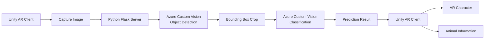

# AR Animal Recognition

> Azure Custom Vision 기반 2단계 AI 인식(Object Detection + Classification)을 적용한
> Unity 증강현실(AR) 동물 개체 인식 프로젝트

## 🎬 Demo
\-▶ Demo (https://youtube.com/shorts/sGxhFmIRSRA?feature=share)  

---

## 프로젝트 소개

기존의 AR 애플리케이션은 객체를 인식하는 수준에 머무르는 경우가 많으며, 같은 종에 속한 개체를 구분하거나 관련 정보를 제공하는 데에는 한계가 있습니다.

본 프로젝트는 Azure Custom Vision의 Object Detection과 Classification을 결합한 2단계 AI 인식 파이프라인을 적용하여 동물을 탐지하고, 탐지된 객체를 다시 분류하여 개체를 식별하는 모바일 AR 애플리케이션입니다.

탐지된 결과를 기반으로 Unity 환경에서 해당 위치에 AR 캐릭터와 개체 정보를 제공하며, 최종적으로는 수집한 캐릭터를 활용한 미니게임까지 확장하는 것을 목표로 설계했습니다. 현재는 동물 탐지, 개체 인식, AR 캐릭터 생성 기능까지 구현했습니다.

---

## 프로젝트 개요

| 항목 | 내용 |
|------|------|
| 프로젝트명 | AR Animal Recognition |
| 프로젝트 형태 | Microsoft AI School 팀 프로젝트 |
| 개발 기간 | 2024.07.18 ~ 2024.07.25 (8일) |
| 개발 인원 | 4명 |
| 역할 | Team Leader / Unity Client / AR / Azure Custom Vision Integration |

### 담당 역할

- 프로젝트 일정 관리 및 개발 방향 조율
- Unity 기반 모바일 AR 애플리케이션 개발
- Unity와 Python(Flask) 서버 연동
- Azure Custom Vision(Object Detection / Classification) 연동
- Detection 결과 기반 이미지 Crop 및 2단계 AI 인식 파이프라인 구현
- 인식 결과에 따른 AR 캐릭터 및 정보 UI 구현
- 프로젝트 발표 및 시연

---

## 시스템 아키텍처

Unity에서 촬영한 이미지를 Python(Flask) 서버로 전송한 뒤,
Azure Custom Vision의 Object Detection을 통해 동물을 탐지합니다.

탐지된 Bounding Box 영역만 Crop하여 Classification 모델에 입력함으로써
동물의 개체를 식별하고,

최종 결과를 Unity로 전달하여
AR 캐릭터와 개체 정보를 표시하도록 구현했습니다.

---

## 기술 스택

| Category | Technologies |
|------|------|
| **Engine** | Unity 2022 |
| **Language** | C#, Python |
| **AI** | Azure Custom Vision (Object Detection / Classification) |
| **AR** | Unity AR Template |
| **Server** | Flask |
| **Version Control** | Git, GitHub |

---

## 주요 기능

---

## 기술적 문제 해결

---

## 회고
